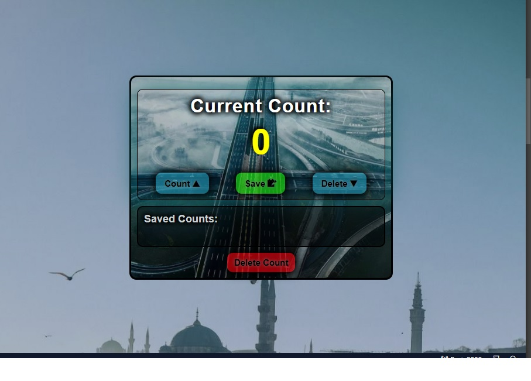
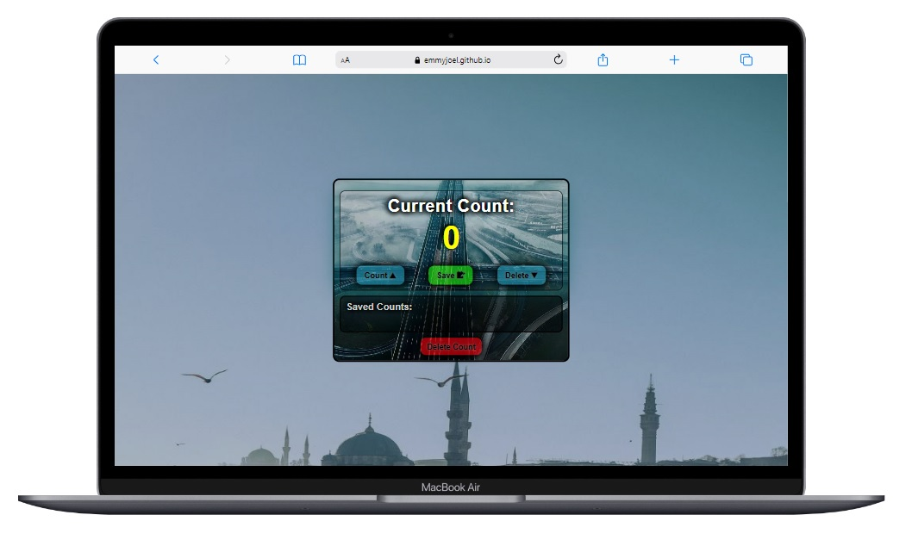
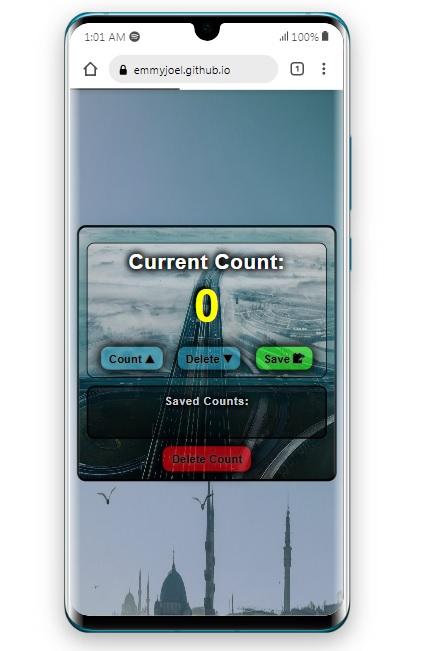

# Counter App.

## Overview

- Ever been faced with a situation of counting and keeping record of number of persons?. I've been there myself and one great challenge I've aways had is keeping track just fine when the number has gone wild, or say when I have to pause counting to continue later. 
- You can't blame me 😄, Counting is one job while keeping track and record of the numbers is another. However your brain can handle it, but why struggle when you can easily do just that with an app as this.
- The COUNTER APP is built to aid every proccess involved with counting and keeping track of counted numbers.
- Designed to a perfect, soothing and calm interface. Aside working with it, you'll love just to see it.

## Previews on different viewports

## How it works

 The app is provides you with all of the following features;

- An increment button [count 🔺] for incrementing/counting numbers.
- A delete/decrement button [Delete 🔻] for decrementing counted number if the need arises.
- A 'save' button for keeping record of counted number at intervals.
- A Delete button to keep track and correct recorded counts.
- Easy to utilize as to say JACK 😏.

## Built with

- HTML
- CSS
- JavaScript

## Links
- Project Live links:
- Netlify : [https://dancing-gnome-8d5e1a.netlify.app]
- Github : [https://emmyjoel.github.io/counter-app/]

## Let's Connect 😃 

- Twitter : [https://www.twitter.com/Jay_n_Codes]
- LinkedIn : [https://www.linkedin.com/in/emmanuel-okhuoya-735576238]